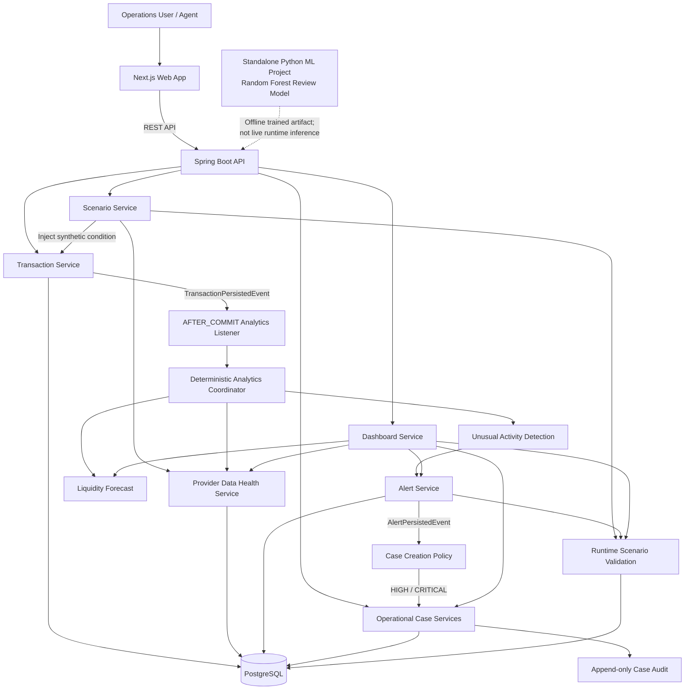

# BNR Baymax

> **Multi-provider liquidity and risk intelligence for safer agent operations**

BNR Baymax is a synthetic, explainable decision-support prototype for a multi-provider mobile financial service agent serving **bKash, Nagad, and Rocket** from one shared physical cash reserve while maintaining separate provider-specific e-money balances.

The product is built around one core principle:

> **Unified visibility, not unified money.**

BNR Baymax helps users see current liquidity, estimate upcoming shortage pressure, surface unusual transaction patterns with evidence and uncertainty, and connect important signals to traceable operational cases. It does **not** execute real financial transactions and does **not** make a final fraud determination.

---

## Problem

A multi-provider agent may appear healthy when balances are viewed only as a combined total, while one provider-specific e-money balance or the shared physical cash reserve is approaching shortage.

For example:

- bKash e-money may be healthy.
- Rocket e-money may be healthy.
- Nagad e-money may be running low.
- The combined balance can still look large.
- The agent may nevertheless become unable to serve Nagad customers.

At the same time, a sudden transaction spike or a repeated near-identical amount pattern may be normal event demand, a data-quality issue, or behaviour requiring human review.

BNR Baymax connects these problems in one operational flow:

```text
SEE
  ↓
PREDICT
  ↓
INJECT CONDITION
  ↓
DETECT SIGNAL
  ↓
EXPLAIN
  ↓
ACT
  ↓
VALIDATE
```

---

## What BNR Baymax Does

### SEE — Unified operational visibility

BNR Baymax shows:

- one shared physical cash position;
- separate bKash e-money balance;
- separate Nagad e-money balance;
- separate Rocket e-money balance;
- provider data-health state.

Provider balances are never treated as freely convertible.

### PREDICT — Liquidity pressure and runway

The deterministic forecast engine evaluates shared physical cash and each provider e-money position separately.

For recent consumption rates:

```text
weightedRate =
    rate15 × 0.50
  + rate30 × 0.30
  + rate60 × 0.20
```

When net consumption is positive:

```text
projectedRunway =
currentBalance / weightedConsumptionPerMinute
```

The system can then estimate approximately when a resource may enter shortage pressure.

When consumption is not positive, the resource is reported as stable rather than showing a fake shortage time.

### DETECT — Explainable unusual-activity signals

The live backend uses deterministic, measurable evidence such as:

- recent transaction velocity;
- recent cash-out volume;
- historical baseline deviation;
- repeated or near-identical amounts;
- account concentration;
- unique synthetic account count;
- provider data health.

Current deterministic signal types include:

- `CASH_OUT_VELOCITY_SPIKE`
- `REPEATED_AMOUNT_CLUSTER`

BNR Baymax intentionally uses careful language:

> **Anomaly is evidence for review, not proof of fraud.**

### EXPLAIN — Evidence, uncertainty, and safe next step

Important alerts expose:

- deterministic evidence;
- possible normal explanation;
- uncertainty;
- safe next step;
- signal confidence;
- confidence score.

The system does not silently produce a high-confidence conclusion when provider data is delayed, missing, or conflicting.

### ACT — Operational case policy

BNR Baymax does **not** detect cases.

The flow is:

```text
Analytics detects a signal
        ↓
Alert Service persists an alert
        ↓
Case Creation Policy evaluates severity
        ↓
HIGH / CRITICAL may open an OperationalCase
        ↓
Case creation is written to the audit trail
```

Current policy:

| Alert severity | Operational behaviour |
|---|---|
| LOW | Alert only |
| MEDIUM | Alert / manual review |
| HIGH | Automatically open an operational case |
| CRITICAL | Automatically open an operational case |

A manually opened case is also supported as a human fallback when automated detection misses an operational issue.

### VALIDATE — Runtime synthetic scenario validation

Scenario expectations are registered **before** a controlled condition is injected.

The real backend pipeline then runs independently:

```text
Expected scenario outcome registered
        ↓
Controlled synthetic condition injected
        ↓
Real backend analytics executes
        ↓
Persisted alerts are observed
        ↓
TP / TN / FP / FN result
        ↓
Runtime metrics calculated
```

The runtime validation layer calculates:

- precision;
- recall;
- false-positive rate;
- accuracy;
- average detection latency.

These runtime analytics metrics are separate from the offline machine-learning holdout reports.

---

## Scenario Lab

Scenario Lab is a controlled synthetic testing environment.

> **We inject the condition, not the alert, and the backend must discover the signal by itself.**

Supported scenarios include:

| Scenario | Purpose |
|---|---|
| `HIDDEN_PROVIDER_SHORTAGE` | Push one provider-specific e-money position toward pressure while other provider balances remain separate |
| `EVENT_DEMAND_SPIKE` | Simulate elevated, diverse, contextually explainable customer demand |
| `REPEATED_AMOUNT_CLUSTER` | Generate near-identical transaction amounts from a small synthetic account group |
| `PROVIDER_FEED_DELAY` | Simulate delayed provider data and reduced analytical confidence |
| `CONFLICTING_BALANCE_DATA` | Simulate conflicting balance information |
| `CASH_OUT_VELOCITY_SPIKE` | Generate materially elevated cash-out count and volume |
| `NORMAL` | Generate ordinary mixed synthetic activity |

Scenario transactions use the real backend transaction service.

Therefore:

- balances actually change;
- scenario transactions are persisted;
- `scenarioRunId` is preserved;
- `AFTER_COMMIT` analytics runs;
- alerts are not inserted directly by Scenario Lab;
- case creation remains owned by backend policy.

---

## Architecture



### Provider boundary

```text
Shared Physical Cash
        │
        ├── serves bKash operations
        ├── serves Nagad operations
        └── serves Rocket operations

Provider e-money:
BKASH  ─ separate
NAGAD  ─ separate
ROCKET ─ separate
```

BNR Baymax may display an informational provider e-money total for visibility, but it never implies that one provider balance can be transferred to or converted into another.

---

## Repository Structure

```text
bkash-baymax/
├── bnr-baymax-ml/
│   ├── data/
│   ├── models/
│   ├── reports/
│   ├── src/
│   ├── model_feature_schema.json
│   └── requirements.txt
├── superagent-api/
├── superagent-web/
├── .env.example
├── .gitignore
└── README.md
```

### `superagent-api`

Java 21 / Spring Boot backend responsible for:

- domain persistence;
- transaction processing;
- balance semantics;
- liquidity forecasting;
- provider data health;
- deterministic unusual-activity detection;
- alert persistence;
- case creation policy;
- Scenario Lab execution;
- runtime validation metrics;
- dashboard aggregation.

### `superagent-web`

Next.js 14 frontend responsible for:

- dashboard visualization;
- Scenario Lab controls;
- alert review;
- case visibility;
- runtime validation presentation;
- bounded post-scenario refresh.

The frontend renders backend state. It does not create alerts or cases.

### `bnr-baymax-ml`

Standalone Python ML project responsible for:

- synthetic dataset generation;
- 15-minute feature engineering;
- train/validation/test preparation;
- event-aware Random Forest training;
- threshold selection;
- ML evaluation reports;
- trained joblib artifact.

The trained model currently remains an **offline advisory artifact**. Live Spring Boot ML inference is not part of the current runtime path.

---

## Technology Stack

### Frontend

- Next.js 14
- TypeScript
- App Router
- existing Tailwind utility usage / vanilla CSS
- Enterprise Neumorphism UI

### Backend

- Java 21
- Spring Boot
- Spring MVC
- Spring Data JPA
- PostgreSQL
- Maven

### Machine Learning

- Python
- pandas
- scikit-learn
- joblib
- Random Forest classifier

---

## Prerequisites

Install:

- **JDK 21**
- **Node.js** compatible with the Next.js project
- **npm**
- **Python 3**
- **PostgreSQL** for the development backend profile

Verify Java:

```powershell
java -version
javac -version
```

Both should resolve to Java 21 for the backend.

Verify Maven Wrapper Java:

```powershell
cd D:\bkash-baymax\superagent-api
.\mvnw.cmd -version
```

---

## Environment Setup

### Frontend environment

Create:

```text
superagent-web/.env.local
```

Example:

```env
NEXT_PUBLIC_API_BASE_URL=http://localhost:8080
```

The repository includes `.env.local.example` when present.

Do not place provider credentials, PINs, OTPs, passwords, or real financial secrets in environment files.

### Backend development profile

The backend is started with:

```powershell
$env:SPRING_PROFILES_ACTIVE="dev"
```

Configure the development PostgreSQL connection using the existing Spring configuration under `superagent-api/src/main/resources`.

Do not commit real database credentials.

---

## Run the Backend

```powershell
cd D:\bkash-baymax\superagent-api

$env:JAVA_HOME = "<YOUR_JDK_21_ROOT>"
$env:Path = "$env:JAVA_HOME\bin;$env:Path"

$env:SPRING_PROFILES_ACTIVE="dev"

.\mvnw.cmd spring-boot:run
```

Backend:

```text
http://localhost:8080
```

### Backend tests

```powershell
cd D:\bkash-baymax\superagent-api
.\mvnw.cmd test
```

The latest local integration verification reported **32 backend tests passing**.

---

## Run the Frontend

```powershell
cd D:\bkash-baymax\superagent-web

npm install
npm run dev
```

Frontend:

```text
http://localhost:3000
```

### Production build verification

```powershell
npm run build
```

The latest local integration verification completed without TypeScript build errors.

---

## Run and Verify the ML Project

```powershell
cd D:\bkash-baymax\bnr-baymax-ml

python -m venv .venv
.\.venv\Scripts\Activate.ps1

python -m pip install --upgrade pip
pip install -r requirements.txt

python src\train_model.py
```

Expected trained artifact:

```text
bnr-baymax-ml/models/anomaly_review_pipeline.joblib
```

Model metadata:

```text
bnr-baymax-ml/models/model_metadata.json
```

Exact feature contract:

```text
bnr-baymax-ml/model_feature_schema.json
```

---

## ML Review Model

The standalone ML model predicts:

```text
requires_review
```

Target meaning:

```text
0 = normal or contextually explainable synthetic activity
1 = transaction behaviour requiring human review
```

It does **not** predict fraud.

### Model

```text
OneHotEncoder / preprocessing
        +
RandomForestClassifier
```

The complete preprocessing-plus-model pipeline is saved as one joblib artifact.

### Exact model feature contract

The model uses 27 features:

1. `agent_profile`
2. `region`
3. `provider_code`
4. `hour_of_day`
5. `day_of_week`
6. `is_weekend`
7. `transaction_count`
8. `cash_in_count`
9. `cash_out_count`
10. `cash_in_amount`
11. `cash_out_amount`
12. `average_amount`
13. `median_amount`
14. `amount_std_deviation`
15. `unique_account_count`
16. `top_account_share`
17. `near_identical_amount_count`
18. `repeated_amount_ratio`
19. `baseline_transaction_count`
20. `baseline_cash_out_amount`
21. `transaction_count_multiplier`
22. `cash_out_amount_multiplier`
23. `is_event_active`
24. `recent_event_within_3d`
25. `event_type`
26. `event_proximity_days`
27. `event_demand_multiplier`

### Leakage protection

The following fields are intentionally excluded from model input:

- `scenario_type`
- `scenario_run_id`
- `event_name`
- `window_id`
- `split`
- `split_group`
- `window_date`
- `agent_code`

Scenario names and row identifiers are used for audit, generation, grouping, or evaluation — not classifier input.

### ML dataset summary

The prepared synthetic v1 dataset contains:

| Measurement | Value |
|---|---:|
| Raw synthetic transactions | 45,975 |
| Synthetic agents | 20 |
| Providers | 3 |
| 15-minute feature windows | 6,176 |
| Review-positive windows | 377 |
| Negative/contextual windows | 5,799 |
| Positive review rate | 6.10% |

Split sizes:

| Split | Rows | Positive | Negative |
|---|---:|---:|---:|
| Train | 4,323 | 263 | 4,060 |
| Validation | 811 | 59 | 752 |
| Test | 1,042 | 55 | 987 |

Scenario-run groups are kept separate across train, validation, and test.

### Event-aware logic

Synthetic event context includes examples such as:

- Eid periods;
- Durga Puja period;
- Christmas period;
- salary periods;
- Sylhet Trade Fair;
- Admission Week.

This is **synthetic demonstration context**, not an official calendar.

Event context does not automatically cancel unusual evidence.

For example:

```text
High activity
+ many unique accounts
+ diverse amounts
+ relevant event context
→ may be contextually explainable
```

But:

```text
Event active
+ few accounts
+ near-identical amounts
+ high repeated-amount ratio
→ may still require human review
```

The synthetic ML dataset includes `EVENT_REPEATED_AMOUNT_CLUSTER` as a review-positive scenario for this reason.

---

## Validation Evidence

BNR Baymax exposes both **live runtime scenario validation** and **offline ML holdout evaluation** as separate evidence sources.

### Runtime synthetic analytics validation

The backend dynamically calculates:

- precision;
- recall;
- false-positive rate;
- accuracy;
- average detection latency.

These values come from persisted `ScenarioValidationResult` records and depend on the scenarios evaluated in the live backend.

API:

```text
GET /api/v1/validation/metrics
```

They are **not** copied from the ML test reports.

### Offline ML holdout evidence

The controlled synthetic v1 Random Forest reports:

| Metric | Validation | Test |
|---|---:|---:|
| Accuracy | 1.0000 | 1.0000 |
| Precision | 1.0000 | 1.0000 |
| Recall | 1.0000 | 1.0000 |
| F1 | 1.0000 | 1.0000 |
| False-positive rate | 0.0000 | 0.0000 |

Test confusion counts:

```text
TN = 987
FP = 0
FN = 0
TP = 55
```

Selected validation threshold:

```text
0.20
```

### Important interpretation

> **The controlled synthetic v1 scenarios are deliberately well-defined. The strong holdout result validates the feature, preprocessing, training, and evaluation pipeline. It is not a production-readiness claim.**

The current model has not been validated on real provider or customer data.

Future analytical work includes harder overlapping synthetic scenarios, noisier behaviour, probability calibration, threshold recalibration, drift monitoring, and real-world validation under appropriate authorization.

### Engineering verification

Latest local integration checks reported:

- 32 Spring Boot backend tests passing;
- Next.js production build completing without TypeScript errors;
- model artifact loading as a scikit-learn `Pipeline`;
- `preprocessor` and `model` named steps;
- `RandomForestClassifier` as the classifier;
- group-safe scenario split overlap of zero.

---

## Sample Synthetic Development Data

The development seed includes a synthetic prototype agent:

```text
Agent Code: AGT-001
Display Name: Rahim Store
```

Initial synthetic liquidity position:

| Resource | Initial synthetic balance |
|---|---:|
| Shared physical cash | ৳100,000 |
| bKash e-money | ৳50,000 |
| Nagad e-money | ৳40,000 |
| Rocket e-money | ৳30,000 |

The development seed also creates deterministic baseline transactions used by forecasting and analytical comparison.

Balances change as scenarios and simulator transactions are executed.

### Transaction semantics

For `CASH_OUT`:

```text
Shared physical cash ↓
Selected provider e-money ↑
```

For `CASH_IN`:

```text
Shared physical cash ↑
Selected provider e-money ↓
```

A transaction is rejected when it would create a negative balance.

---

## Key API Endpoints

### Dashboard

```text
GET /api/v1/dashboard?agentCode=AGT-001
```

### Balances

```text
GET /api/v1/balances?agentCode=AGT-001
```

### Transactions

```text
GET /api/v1/transactions?agentCode=AGT-001
```

### Manual synthetic transaction

```text
POST /api/v1/simulator/transactions
```

### Liquidity forecast

```text
GET /api/v1/liquidity/forecast?agentCode=AGT-001
```

### Provider data health

```text
GET /api/v1/data-health?agentCode=AGT-001
```

### Alerts

```text
GET /api/v1/alerts?agentCode=AGT-001
GET /api/v1/alerts/{alertCode}
```

### Operational cases

```text
GET /api/v1/cases?agentCode=AGT-001
GET /api/v1/cases/{caseCode}
POST /api/v1/cases/manual
```

### Scenario Lab

```text
GET  /api/v1/scenarios/definitions
POST /api/v1/scenarios/{scenarioType}/run?agentCode=AGT-001
GET  /api/v1/scenarios/runs?agentCode=AGT-001
GET  /api/v1/scenarios/runs/{scenarioRunId}
```

### Runtime validation

```text
GET  /api/v1/validation/metrics
GET  /api/v1/validation/scenarios?agentCode=AGT-001
GET  /api/v1/validation/scenarios/{scenarioRunId}
POST /api/v1/validation/scenarios/{scenarioRunId}/evaluate
```

---

## Quick End-to-End Demo

Start the backend and frontend.

Open:

```text
http://localhost:3000
```

Then demonstrate:

1. **Dashboard** — show shared physical cash and separate bKash, Nagad, and Rocket e-money balances.
2. **Prediction** — show weighted liquidity runway and estimated shortage pressure.
3. **Scenario Lab** — run `REPEATED_AMOUNT_CLUSTER`.
4. Show the real `scenarioRunId`, status, and committed transaction count.
5. **Alerts** — open the persisted repeated-amount alert.
6. Show deterministic evidence, possible normal explanation, uncertainty, and safe next step.
7. **Cases** — show the case opened by backend policy when a HIGH/CRITICAL alert qualifies.
8. Show the `CASE_CREATED` audit event.
9. **Validation** — show runtime synthetic scenario metrics.
10. Explain the standalone ML artifact and clearly distinguish offline ML evaluation from the current live deterministic inference path.

Recommended demo line:

> **BNR Baymax turns multi-provider transaction activity into early liquidity warnings, explainable review signals, and traceable human actions.**

---

## Data and Simulation Note

All data used by BNR Baymax is synthetic.

The prototype does not connect to:

- production bKash APIs;
- production Nagad APIs;
- production Rocket APIs;
- real wallets;
- real customer accounts;
- real transaction accounts;
- real provider settlement systems.

Synthetic identifiers are used for agents and transaction accounts.

Scenario Lab creates controlled conditions using deterministic or bounded synthetic patterns.

Examples include:

- elevated cash-out velocity;
- repeated near-identical transaction amounts;
- provider-specific e-money pressure;
- delayed provider feed;
- conflicting balance data;
- event-linked demand increase.

### Assumptions

- One agent has one shared physical cash position.
- Each provider e-money balance is logically separate.
- Provider balances cannot be automatically converted or merged.
- Recent historical synthetic behaviour can form a baseline for controlled analytical testing.
- Runtime analytical signals are advisory.
- Human review remains required before real-world action.

### Limitations

- No real provider integration.
- No real financial transaction execution.
- No real customer data.
- Synthetic scenarios are cleaner than real-world behaviour.
- Offline ML results are not production-readiness evidence.
- Event context is synthetic and not an official calendar.
- The current trained ML artifact is not yet integrated into live Spring Boot inference.
- Current automatic case handling focuses on policy-driven case opening and creation audit; a complete acknowledge, assignment, escalation, note, and resolution lifecycle may require further implementation where not already available in the deployed branch.

---

## Responsible Design and Guardrails

BNR Baymax intentionally does **not**:

- execute real cash movement;
- transfer liquidity between providers;
- convert bKash balance into Nagad or Rocket balance;
- access production provider APIs;
- access real wallets;
- request PINs, OTPs, passwords, or private keys;
- automatically block users;
- freeze funds;
- accuse agents or customers;
- make a final fraud determination;
- present synthetic validation as production fraud-detection readiness.

### Human-review boundary

An alert is an operational review signal.

The system exposes:

- why the signal was raised;
- measurable evidence;
- uncertainty;
- possible normal explanation;
- a safe next step.

Human operators remain responsible for authorized real-world review and action.

### False-positive awareness

Normal operational demand can resemble unusual behaviour.

Examples include:

- religious festivals;
- salary periods;
- local events;
- admission periods;
- temporary market rush.

For that reason, event context is treated as an additional analytical feature rather than an automatic reason to ignore evidence.

### Data-quality fallback

Provider data health is represented as:

```text
LIVE
DELAYED
MISSING
CONFLICTING
```

Delayed data lowers confidence.

Missing or conflicting data should result in uncertainty-aware fallback rather than a high-confidence recommendation.

> **Garbage data should not produce confident intelligence.**

---

## Success Criteria Addressed

BNR Baymax demonstrates:

- meaningful multi-provider visibility rather than unrelated charts;
- separate provider boundaries and one shared cash reserve;
- provider-aware and shared-cash shortage pressure;
- approximately when shortage pressure may occur;
- explainable unusual-activity detection;
- careful non-fraud language;
- evidence, uncertainty, and safe next steps;
- provider data-health fallback;
- controlled what-if scenarios;
- traceable alert-to-case policy flow;
- runtime analytical validation;
- standalone event-aware ML experimentation;
- documented assumptions and limitations.

---

## Current ML Runtime Status

Truthful current status:

```text
Synthetic ML dataset prepared             ✅
15-minute feature engineering             ✅
Group-safe train/validation/test splits   ✅
Random Forest trained                     ✅
Validation threshold selected             ✅
Joblib model artifact saved               ✅
ML evaluation reports generated           ✅

Live Spring Boot ML inference             ❌
Website live ML review probability        ❌
```

The live product remains useful without the ML runtime because deterministic evidence, liquidity forecasting, data-health uncertainty, Scenario Lab, alerts, cases, and runtime validation are active backend capabilities.

The ML project is a prepared advisory extension for later inference deployment.

---

## Project Statement

> **BNR Baymax turns multi-provider transaction activity into early liquidity warnings, explainable review signals, and traceable human actions.**

### Banglish summary

> **Ekjon super agent ekoi physical cash diye bKash, Nagad, Rocket service dey, but provider e-money balance alada. BNR Baymax current liquidity dekhe, recent transaction rate diye shortage pressure estimate kore, measurable unusual pattern explain kore, serious alert hole backend policy operational case open korte pare, ar controlled synthetic scenario diye real analytics pipeline validate kore. System fraud declare kore na and real money move kore na.**

---

## Disclaimer

BNR Baymax is a hackathon prototype built with synthetic data for controlled decision-support demonstration.

It is not a production financial system, fraud determination system, regulatory decision engine, or authorized provider integration.
